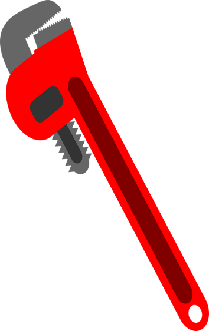

===============================
Chapter 2: Plumber's Hand Tools
===============================

Pipe wrench of size 12”, 9”, and up to 18” long
===============================================

Pipe wrench are classified by the length of the handle. They can be available in any size from 3 inches up to 48 inches or larger. It has teeth and jaw made up of steel while body could be aluminum or steel. It is adjusted with the help of rings and springs for different radius.

    
    Figure 2-1. Pipe wrench

|
|
|

Pair of footprints
==================

.. warning:: Not available

|
|
|

Stocks and dies, up to 2” diameter, replacement of cutters 
==========================================================

To connect two or more pipes while plumbing we need to create threading in pipes so that they connect as a single pipeline. For that we need die stock and dies.

A diestock is an equipment which helps us to create uniform threads on different types of screws, bolts and pipes. It is a framework as shown in figure that provides space to insert cutting tools called dies. Also, it helps to makes sure the amount of pressure applied throughout the thread cutting process remain uniform.   

.. figure:: images/2-2a.jpg
    :alt: Image showing Stock
    
    Figure 2-2 a) Stock

A die is a razor sharp which can cut into the metal of cylindrical materials, like screw or pipe facing with relative ease.

.. figure:: images/2-2b.jpg
    :alt: Image showing Dies
    :scale: 120%
    
    Figure 2-2 b) Dies

|
|
|

Wrench chain 
============

It is a type of wrench with chain and adjustable handle where chain wraps around a cylindrical material to tighten or loosen its grip. Handle is turned anticlockwise to grip and unscrew the filter. It may be either a strap-type wrench or a socket.

.. figure:: images/2-3.jpg
    :alt: Image showing Wrench chain
    :scale: 50%
    
    Figure 2-3. Wrench chain

|
|
|

Hack's saw frame and blade
==========================

A hacksaw is a fine-toothed saw which is made for cutting metals and other materials like wood and plastic. It consists of a frame and a blade. Common hacksaw are hand saws with C-shaped frame that holds blade under tension.

Similarly, hacksaw blades has fine tooth pointing in forward direction with fourteen to thirty-two teeth per inch (TPI) and measuring 10 to 12 inches. There are varieties of hacksaw available for different uses like panel hacksaw, junior hacksaw and power hacksaw.

    
    Figure 2-4. Hacksaw

|
|
|

Measuring tape
==============

It is important to know the diameter of the pipe you are working with because a hot top saddle or a pipe fitting must fit exactly onto the pipe. Similarly, to measure the length of pipe we need retractable steel tape.

.. figure:: images/2-5.png
    :alt: Image showing Measuring tape
    :scale: 50%

    Figure 2-5. Measuring tape

|
|
|

Soldering iron
==============

A soldering iron is a hand tool used to join two workpieces by supplying heat to melt filler material that flow into joint. It consists of metal tip and insulated handle shown in figure. It is commonly used for repairs, assembly and installation. It can be electrically powered or gas to heat up the metal tip.

    Figure 2-6. Soldering iron

|
|
|

Tin snips 
=========

Tin snips or tinner snips are type of snips which are mainly used for cutting tin and other sheet metal surface. It has long handle and short blades with extra wide jaws made up of drop forged carbon steel as shown in figure. It has two main types according to which tin snips are cut: straight- pattern and duckbill pattern. Straight pattern is best for straight cuts and gentle curves while duckbill-pattern snips (or trojan-pattern snips) are best for cutting any curves like circles or wave like structures.

.. figure:: images/2-7a.jpg
    :alt: Image showing Curve tin snip
    :scale: 50%

    
    Figure 2-7 a) Curve tin snip

.. figure:: images/2-7b.jpg
    :alt: Image showing Straight tin snip
    :scale: 50%

    Figure 2-7 b) Straight tin snip

|
|
|

Rasp
====

Rasp is a hand tool with coarse teeth used to scrape or abrade the material surface. Rasp can be of different types like Flat mill, half-round second-cut, flat wood rasp and half-round wood rasp. Flat mill rasp smooths edges and sharpens blades while flat wood rasp is used to smoothen wood, leather, soft metals and soft plastics. Similarly, half-round second-cut smooths inside surface of pipes or holes and half round wood rasp is ideal for use on wood and soft materials like plastics.

.. figure:: images/2-8.jpg
    :alt: Image showing Rasp
    :scale: 50%

    Figure 2-8. Rasp

|
|
|

Caulking iron
=============

Caulking iron or making iron are used for packing or putting the Cotton or Oakum into the seam between the planks especially in ship building and in leaded cast iron pipe joints. In pipe joints oakum (a rope like substance made from jute, tar and Bentonite clay) is packed into the joints using a yarning iron. Oakum swells when its moist and makes a tight joint. Melted lead is poured into the joint covering the oakum and when lead cools down we tighten the lead using caulking iron. Caulking irons are used to hammer the lead into the recessed end of the pipe joint which makes a sturdy permanent seal.

.. figure:: images/2-9.jpg
    :alt: Image showing Caulking iron
    
    Figure 2-9 Caulking iron

|
|
|

Adjustable wrench up to 12” long
================================

Adjustable wrench or crescent wrench has gripping faces of the jaws displaced to a 15-degree angle relative to the tool’s handle. It comes to handy when you have to work with various diameter of pipes repeatedly. Gripping section of wrench can be adjusted in size to fit a range of nuts, bolts, or fittings that have flat sides using roller or ring available within wrench as shown in figure. You must always position the adjustable wrench as the force pushes against the fixed jaw. It comes in several sizes and 10-inch wrench is commonly used for general purposes.

    Figure 2-10. Adjustable wrench

|
|
|

Claw hammers /Ball peen hammer/Claw hammer 
==========================================

Claw hammers comes in two forms : two-piece hammer and single-piece hammer. Two piece hammer consists of a head connected to a handle which is made of hickory and single-piece claw hammer is a continuous mass of metal with head and handle. 

A claw hammer is a hammer having a head with two sides. The one face is a flat surface meant for tapping the nails and manipulating chisels. The other side of the head is the claw that is mainly used for removing nails.

    Figure 2-11. Claw hammer

Ball peen hammer or engineer’s hammer is a type of hammer that has one end of its head shaped in a hemisphere called peen and used in working metal like beating metals. The rounded face is effective for shaping metal without leaving hammer marks.

    
    Figure 2-12 Ball peen hammer

|
|
|

Pipe cutter-use and care adjustment of cutting wheels 
=====================================================

It has always been acknowledged that the best way to cut pipe is  by using pipe cutter because this method assures the pipe is cut squarely, accurately and quickly. Pipe cutter are available in different sizes. Use depends on pipe size, material and situations. Figure shows the pipe cutter when its components are separated and combined.

.. figure:: images/2-12a.png
    :alt: Image showing Pipe cutter
    

.. figure:: images/2-12b.png
    :alt: Image showing Pipe cutter's parts
    
    Figure 2-13 Pipe cutter

1) Select the Correct cutter
----------------------------

    To get maximum performance from a tool, one should always ensure that the correct model of pipe cutter has been selected for the job else it may result in serious injury and damage to the tool and workpiece.

2) Adjustment of cutting wheel
------------------------------

    Always ensure that when selecting the cutter, the cutting wheel is of the type suited to – the cutter being used and the material to be cut. 
    
    Always inspect the cutter wheel before being used to see that it is not blunt or damaged in any way.

    .. figure:: images/2-13.png
        :alt: Image showing Adjustment of cutting wheel

3) Mounting the cutter on the pipe
----------------------------------

    Open the cutter by turning the feed handle counter clockwise direction and place the cutter on the pipe with great care so that the rollers are in contact with the pipe. Then, turn the screw handle clockwise until the cutter wheel contacts the pipe.

    .. figure:: images/2-14.png
        :alt: Image showing Mounting the cutter on the pipe

4) True Tracking
----------------
    After cutter wheel is in contact with the pipe, slowly turn the feed screw ¼ of a turn and rotate the cutter through 360° so that the wheel cuts a light groove. Check this groove if it “tracks” into the original starting groove. If it does, the result will be a good cut else it will not cut. If the cutter does not track, the cutter wheel might be damaged and should be replaced.

    .. figure:: images/2-15.png
        :alt: Image showing  True Tracking

5) The cut
----------
    Having ensure a “true track”, tight the feed screw turning a quarter and rotate the cutter around the pipe progressively tightening the screw at each turn until the pipe is cut. Do not force the cutter wheel into the pipe which may result in damage and shortening the life of the cutter wheel.

    .. figure:: images/2-16.png
        :alt: Image showing the cut using pipe cut

Following are the steps for proper maintenance of pipe cutters:
    
    |   a) Always clean the tools correctly after each jobs using cleaning agent and wire brush to clean the feed screw, rollers and cutter wheel.
    |
    |   b) Always ensure that the feed screw, slide, rollers and cutter wheels are well lubricated using suitable lubricating oil.
    |
    |   c) Inspect the all the components of pipe cutters frequently and examine for proper tracking and cutter wheel sharpness.
    |
    |   d) Always store correctly. For example, hang cutter in a warm dry area.

|
|
|

Drilling machine and its bits 
=============================

Drilling machine is commonly used tool for making holes in plastic plugs, pipes, marble or stone tiles and stone or brick walls as well as woods. It works on electric power and some drilling machines for normal uses are also chargeable. Drilling machine has different components as shown in figure. 

Drilling bits of different diameters are available like 1, 0.5, 2, 3, 4 etc. Bits used for drilling walls and marble differs from bits used for drilling wood and iron materials. Drilling bits with specific details of its structure and types are given below in figure. Chuck has sockets to hold drill bits of various sizes according to our job. Drilling machine have switch of forward and reverse option which helps to rotate it in both directions. It also has a selector switch to be selected in case of drilling at wall, wood and iron.

    
    Figure 2-17 a) Drilling bit

    Figure 2-17 b) Drilling machine

|
|
|

Pipe vise
=========

Pipe vice is used for holding pipes for cutting or threading purposes. It is mainly made of steel and is available in different sizes like 25, 50, 100, 150mm. You should be very careful while tightening the pipes in pipe vice which may result in damage of pipes. 

.. figure:: images/2-18.jpg
    :alt: Image showing Pipe vise
    :scale: 50%

    Figure 2-18. Pipe vise

|
|
|

Bench vice
==========

Bench vice is used for holding pipes for cutting or threading purposes. It is mainly made of steel and is available in different sizes from 100 to150mm. It should not be used as base for hammering.

    Figure 2-19. Bench vice

|
|
|

Spanners of various size
========================

Spanners are made of steel and its different sizes are available to suit different purposes. They are used for tightening and loosening bolts, nuts and screws. 

.. figure:: images/2-20.jpg
    :alt: Image showing Spanners of various size
    :scale: 50%

    Figure 2-20. Spanners of various size

|
|
|

Folding rules metallic/steel
============================

The folding rule comes to handy when you had to measure frequently but laboriously. The individual folding rules are connected by spring-loaded joints which locked into place. The folding rules available are wooden folding rule, plastic folding rule and metallic folding rule.

    
    Figure 2-21. Folding rules

|
|
|

Try square, Vernier caliper joining elements: - Nuts, bolts, washer, pins, screws and rivets and jute/pipe tape and lead
========================================================================================================================

Try square
----------

    Try square is a woodworking or a metalworking tool for marking and measuring workpiece. Its primary work is to measure the right angle (90 degrees) of corners accurately. And to try a surface means to check its straightness or correspondence relative to an adjoining surface. It is found in size 15 cm, 20 cm, 30 cm etc. We should avoid oily surfaces while measuring with try square.

.. figure:: images/2-22.png
    :alt: Image showing Try square
    :scale: 70%

    Figure 2-22. Try square

|

Vernier caliper
---------------

    Vernier caliper is an instrument that measures internal or external dimensions and distances. It helps in making more precise measurements than other regular rulers. Before measuring, close the jaws and faces to zero out the reading so that we get a precise measurement otherwise you will have to correct for the zero error. For measuring any length, compare the 0 line of the Vernier scale with the main scale. Then check the division that coincides with the graduated or main scale and add the first reading with the third reading by multiplying.
    
    A scale cannot measure objects which are smaller than 1mm, but a Vernier caliper can measure up to 1mm.

    
    Figure 2-23 a) Vernier caliper

|

 Vernier caliper measures different joining elements which are briefly describe below:

    .. admonition:: Nut
    
        Nut is a perforated block usually of metal that has an internal screw thread and used on a bolt or screw for tightening or holding something. It is available in different size and shapes as shown in figure.
    
        .. figure:: images/2-23b.png
            :alt: Image showing Nut
            :scale: 50%

            Figure 2-23 b) Nut

    .. admonition:: Bolt
    
        Bolts is a metal rod or pin for fastening object together that usually has a head at one end and a screw thread at the other end is secured by a nut.
    
        .. figure:: images/2-23c.png
            :alt: Image showing Bolt
            :scale: 50%

            Figure 2-23 c) Bolts

    .. admonition:: Washer
    
        Washer is a flat thin ring, or a perforated plate used in joints or assemblies to ensure tightness, prevent leakage or relieve friction.
        
        .. figure:: images/2-23d.jpg
            :alt: Image showing Washer
            :scale: 50%
            
            Figure 2-23 d) Washer

    .. admonition:: Screw
        
        Screw is a nail-shaped or rod-shaped piece with a spiral groove with slotted head designed to be inserted into material by rotation usually with the help of screwdriver. It is one of the simple machines and is used for fastening pieces of solid material together.
        
        .. figure:: images/2-23e.png
            :alt: Image showing Screw
            :scale: 50%
            
            Figure 2-23 e) Screw

|

Rivets
------

Rivets are metal pin for passing through holes in two or more plates or pieces to hold them together, usually made with a head at one end, the other end being hammered into head after insertion. Rivets are inserted with the help of hammer or riveting machine. For example, bridge components are connected together with the help of rivet joints.

    
    Figure 2-24. Rivets

|

Jute/pipe tape
--------------

Jute/pipe tape are wrapped around the outer threads of pipe before two pipes are connected as one. This tape is used for stopping leakage and other mishaps. This tape is use because of its anti-corrosive and moisture resistant nature.

.. figure:: images/2-23g.jpg
    :alt: Image showing Jute/pipe tape
    :scale: 50%
    
    Figure 2-25. Jute/pipe tape

|
|
|

What's Next
===========

`chapter3`_ 

.. _chapter3: chapter03.html
