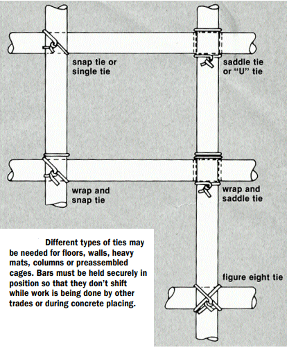
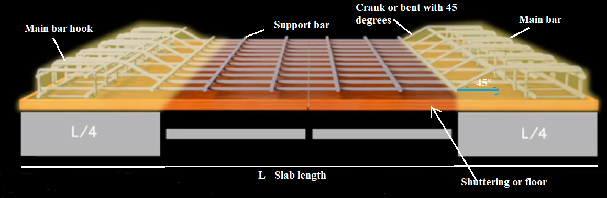
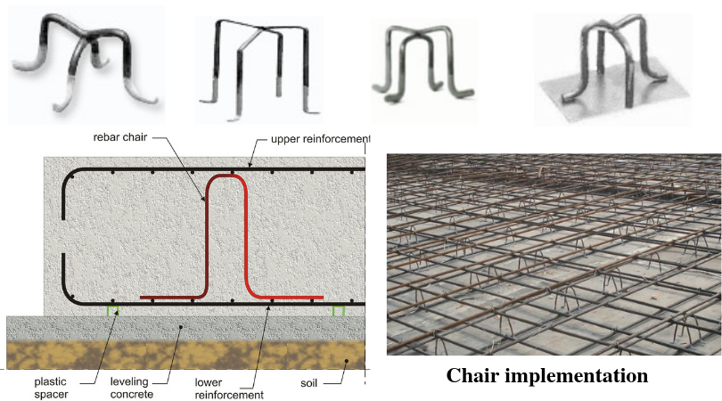
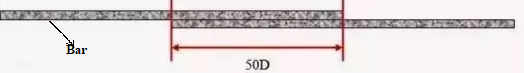
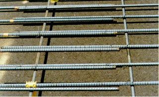

============================
Chapter 7: Bar Bending Works
============================

Straight making bars methods
============================

To bring the metal back into the proper shape you need to employ some metal straightening methods. Some methods for doing so are

1) Heat straightening
---------------------

    Heat straightening involves applying controlled heat to a deformed part of steel in heating and cooling cycles until the metal gradually straightens. Metals are not to that point when they go molecular changes.  The stress added to the heated metal must not surpass the yield stress of the metal in the heated condition, which is the point at which metal deforms into an undesired shape.

    Welding torches are common source of heat for heat straightening.

2) Hot mechanical straightening
-------------------------------

    It is like heat straightening process except it straightens the metal beyond the yield stress. It straightens the metal quickly but can causes unwanted consequences like metal degradation, fractures, wrinkles and buckles.

3) Hot working
--------------

    It is like hot mechanical straightening, except the metal is heated to the point where the metal might undergo molecular changes. This method of metal straightening is even faster, but causes more unpredictability like increased brittleness, cramps, wrinkles, change in molecular structure and so on.
    
4) Screw presses
----------------

    Screw presses are devices that drive a ram into the bent metal through force generated by a screw. Hand-screw presses and hydraulic presses to straighten bent sections and to remove dents from metal sheets. The screw press has weights attached to the handle that helps the press maintain momentum during operation.
    
5) Fastening devices
--------------------

    In this method metals are heated using fabricators. Metal to be strengthen is placed on the straightening plate or an anvil. Tools like tongs, vices and clamps holds the metal in place so the fabricator can move a part of metal until it straighten.

6) Pipe straightening
---------------------

    When straightening pipes, fabricators sometimes fill the pipes with fine-grained sand and close the ends of the pipes. Then the fabricators heat the pipe and straighten it. The sand prevents the pipe section from developing more deformation.

|
|
|

Bar tying methods
=================

Proper tying is necessary to maintain bar position. Wire used for tying reinforcing bars is usually gage black, soft-annealed wire. The various methods of bar tying are used for securing reinforcing bars. Much of the tying is done on flat, horizontal formwork such as floor slabs. Some methods are given below and well-illustrated in the figure.

    Figure 7-1. Different types of ties

    * Snap tie or single tie
    * Wrap and snap tie
    * Wrap and saddle tie
    * U tie or saddle tie
    * Figure eight tie
    * Nailhead tie
    * Double-strand single tie

|
|
|

Categories of bars, e.g. Mild steel bar, T.O.R steel bar and TORKARI bars 
=========================================================================

Categories of bars used for reinforcement are as follows:
    
1) Carbon steel bar
-------------------

    This type of bar is commonly used bar for all types of construction works. It corrodes more easily than other types of bars, so it is wise not to use it in the environments with high humidity.

|

2) THREAD-O-RING steel bar
--------------------------

    One of the many uses of T.O.R bars is as a purge and equalization fitting during plugging operations on pipelines and plant piping.

|

3) TORKARI bars
---------------

    TORKARI is mostly used as reinforcement bar for the concrete in construction works. It is cost effective, weldable and high bending ability.

|

4) Welded wire fabric
---------------------
    It is used in walls and structural floor slabs like road pavement, drainage structures and small concrete canals.

|

5) Sheet-Metal Reinforcement
----------------------------
    It is commonly used in floor slabs, stairs and roof construction. It is composed of annealed sheet steel pieces bent into corrugations of about one-sixteenth of an inch deep with holes punched at regular spacing

|

6) Epoxy-Coated Rebars
----------------------
    These type of rebars are costly and are used in areas with contact to salt water.

|

7) European Rebars
------------------
    These rebars are made up of manganese so they are flexible to bend. They are not used in areas prone to extreme weather condition like earthquakes, hurricanes and other. It is relatively cheaper.

|

8) Stainless Steel Rebars
-------------------------
    It can be used as a cost-effective solution in areas subjected to corrosion problems or where repair is difficult.

|

9) Galvanized Rebars
--------------------
    These rebars are the ideal solution to the environments prone to corrosion. It is costly than other rebars.

|

10) Expanded Metal or Wire Mesh Rebars
--------------------------------------
    These rebars are used as reinforcement in areas where considerable thickness of plaster is required, or to reinforce light concrete construction. It can be used on sidewalks or walkable surfaces that don’t receive high load charges.

|

11) Glass-Fiber-Reinforced-Polymer (GFRP) Rebars
------------------------------------------------
    It is highly expensive rebar which is up to 10 times more cost than epoxy-coated rebars. It will not corrode under any tough environmental situations.

|
|
|

Making L(Hook) procedure to Hook making die and bench
=====================================================

.. warning:: Not available

|
|
|

Making 45 degrees crank procedure 
=================================

Crank bar or bent up bars are provided in slabs or column at the ends of the supports. Those slabs have to deal with two types of moments developed 
    #. The positive moment developed at mid of the span
    #. The negative moment developed at the supports

|

There are two main types of RCC slabs

.. topic:: 1) One way slab

    Main reinforcement is provided in only one direction.

.. topic:: 2) Two way slab

    Main reinforcement is provided in both the direction.

|

The procedure to make 45 degrees crank procedure are as follows:
    
    |   1) The place where slabs are placed is called shuttering. You have to place shuttering oil over there.
    |   
    |   2) Place the beam on two ends of the shuttering such that when a hypotenuse is drawn from L/4 distance (from selected beam’s side) to top of selected beam, it makes an 45° as shown in figure.
    |   
    |   3) Place the main bar and supporting bar in slab and create one way or two-way slab as per your requirement
    |   
    |   4) Place the supporting bar above main bar on L/4 distance from both ends of the slab as shown in figure.
    |   
    |   5) Use the necessary bar bending tools and bend main bar alternately in 45° as in figure.
    |   
    |   6) Make main bar hook to hook the main bar with beam.
    

    Figure 7-2. 45 degrees crank 

|
|
|

Making chair to fix reinforcement methods 
=========================================

Chair-like Steel rebar support is a metal building parts for concrete rod reinforcing. It is also known as support chair, rebar stool and reinforcing steel bar stool. It is used to hold the reinforcement or steel pipes in position when the concrete is poured to strengthen the concrete structure.
	
Following steps need to be followed to make chairs while fixing reinforcement:

    |   1) Take low carbon steel or medium carbon steel as chair making material
    |   
    |   2) Measure the required height of chair, length of chair’s seat which holds the reinforcement 
    |   
    |   3) Mark on the rod according to the measurement for bending purposes
    |   
    |   4) Bent the rod with different bending techniques into the structure as shown in figure.
    |   
    |   5) You can make two-legged chair or four-legged chair based on your requirement.
    |   
    |   6) For four-legged chair you need to weld two two-legged chairs of slightly different leg length.
    |   
    |   7) You can further bend the lower end of chairs for supporting lower slab or use plates as in figure according to reinforcement requirements.
    |   
    |   8) And treat the bottom part of chair leg with plastic coating, plastic caps or iron scraps.
    |   

    Figure 7-3. Making of chair to fix reinforcement methods 

|
|
|

Making overlaps to steel bars
=============================

Steel is the best material for reinforcing concrete because the properties of expansion for both steel and concrete are approximately the same i.e., they will expand and contract at an almost equal rate. Steel is used in tension and concrete is used in compression. Therefore, there are steel bars in the bottom of a beam where tension is greatest and little steel in the top of a beam where compression is greatest. For steel to handle the tension, you need to arrange the bars overlapping so that the bars transfer the force. To do so we can

    * Weld the bars
    * Lap the bars
    * Couple the bars

Lapping bar means the process of overlapping the bars by some distance, so that they transfer the force from one point to another by passing stress through the concrete.

    Steel lapping formula for lap length = 50 X Diameter

Lap length is calculated as follows: If a you have a bar of 10mm diameter the lap length is 500mm (50 X 10).

    Figure 7-4. Lapping of bar

|
|
|

What's Next
===========

`chapter8`_ 

.. _chapter8: chapter08.html
